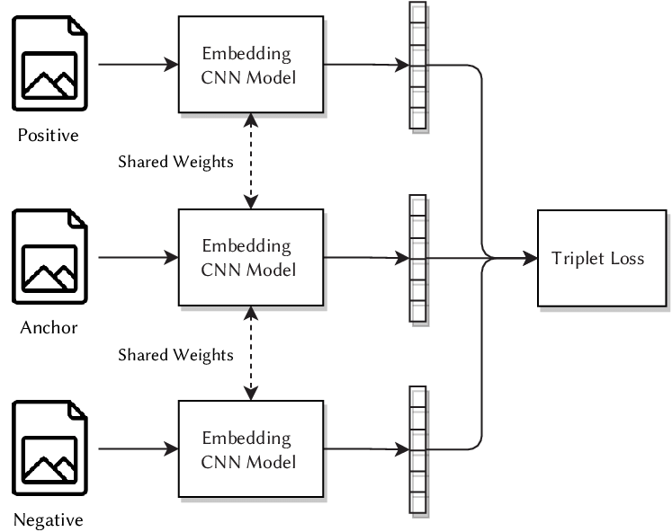
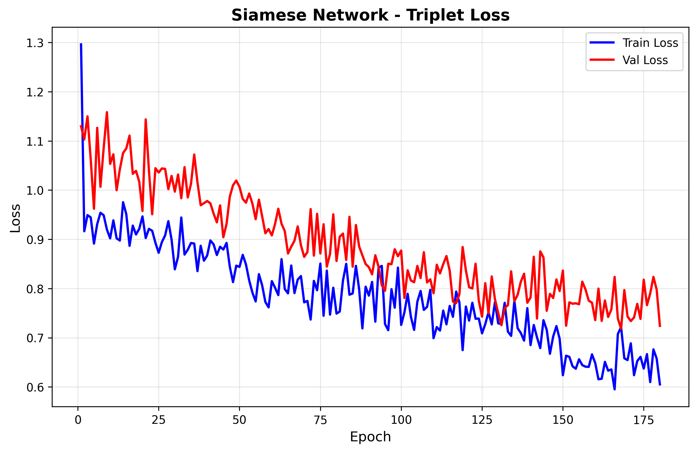
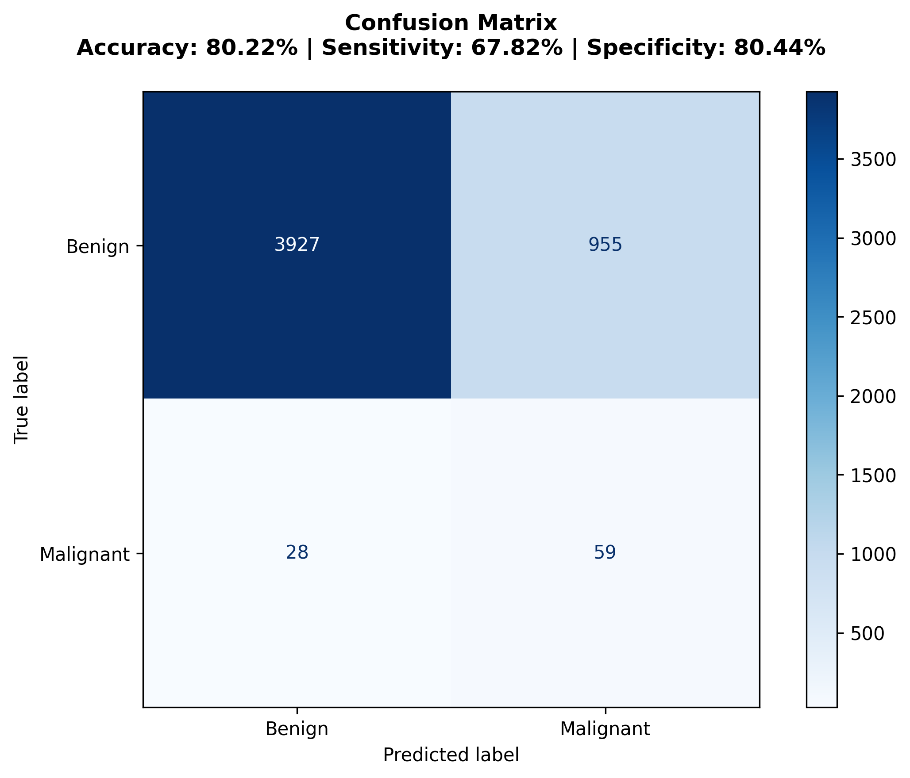
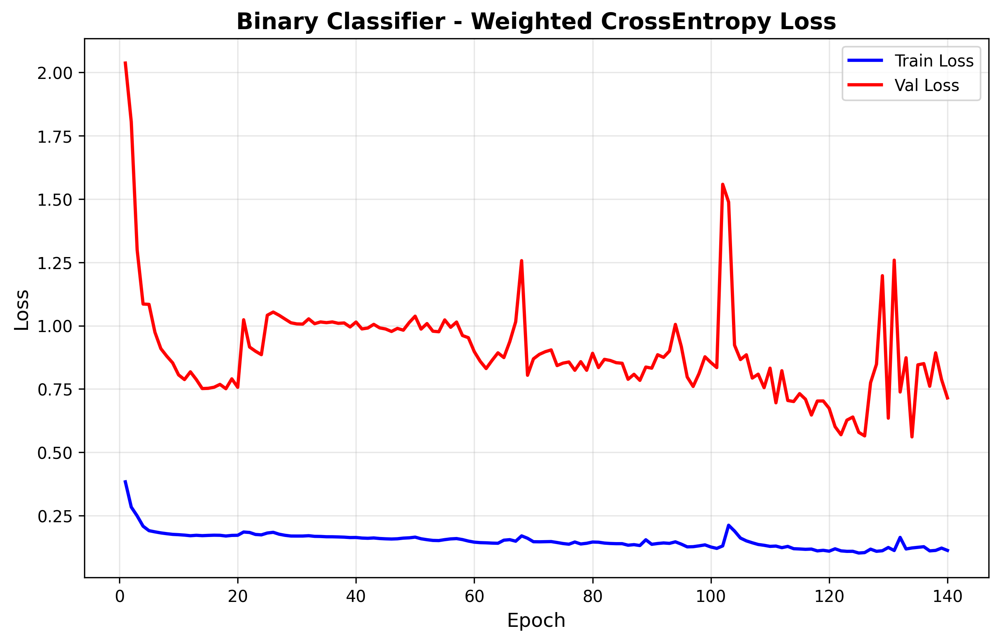
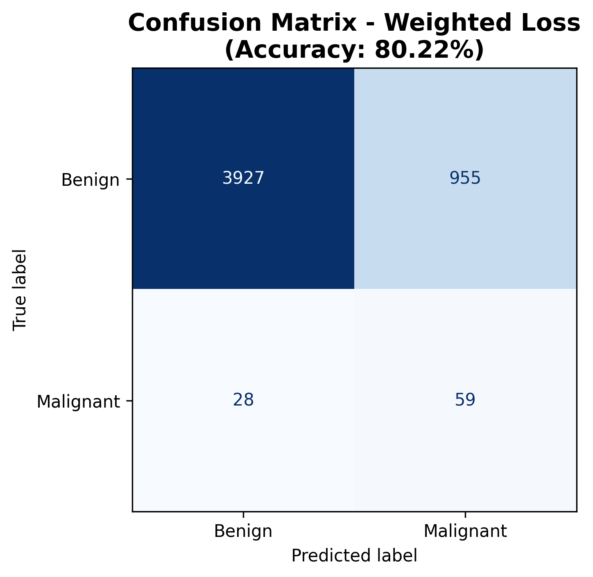

# Siamese Network for Melanoma Classification

## Overview

This project implements a two-stage Siamese neural network pipeline for binary melanoma classification on the ISIC 2020 dataset. The approach combines metric learning via triplet loss with weighted cross-entropy classification to address extreme class imbalance (98% benign vs 2% melanoma), achieving 80.22% accuracy and 67.82% sensitivity on the test set.

## Problem Statement

Melanoma detection requires high sensitivity to minimize missed diagnoses. The ISIC 2020 dataset presents a challenging imbalanced classification task with 33,126 samples (benign = 32,542, melanoma = 584). Traditional classifiers bias toward the majority class; this work applies Siamese networks with batch-hard triplet mining and weighted loss to prioritise melanoma detection.

## Methodology

### Architecture

**Algorithm and problem (what it addresses):** Melanoma screening poses a highly imbalanced recognition problem where the minority class (malignant) is rare but clinically critical to detect. Direct supervised training often biases toward the majority (benign) class, hurting sensitivity. A Siamese metric-learning stage mitigates this by learning an embedding where images from the same class lie close together while images from different classes are far apart. Using triplet loss on (anchor, positive, negative) examples, the representation becomes more class-separable, so a small classifier trained afterward can prioritise recall of melanoma without collapsing to the majority class.

**How it works (high level):** Stage 1 trains a ResNet-50 based Siamese network with triplet loss using randomly sampled triplets from stratified splits and a balanced sampler, producing a 1000-D embedding. The network learns a distance-aware feature space where intra-class distances shrink and inter-class distances expand. Stage 2 freezes the embedding and trains a lightweight multilayer classifier with class-weighted cross-entropy (malignant up-weighted) so that the decision boundary reflects clinical priorities. At inference, a single image is passed through the feature extractor and then the classifier to obtain class logits and probabilities; evaluation uses confusion matrices and sensitivity/specificity metrics aligned with screening use.



<sub>**Figure:** Overview of the Siamese Neural Network architecture using triplet loss function. Source: Promoting Social Media Dissemination of Digital Images Through CBR-Based Tag Recommendation — Scientific Figure on ResearchGate. Available from: [https://www.researchgate.net/figure/Overview-of-the-Siamese-Neural-Network-architecture-using-triplet-loss-function_fig1_363780514](https://www.researchgate.net/figure/Overview-of-the-Siamese-Neural-Network-architecture-using-triplet-loss-function_fig1_363780514) [accessed 1 Nov 2025]</sub>

#### Stage 1 – Siamese Feature Extraction

- **Backbone:** ResNet-50 (random initialization)
- **Embedding size:** 1000-D
- **Loss:** Triplet margin loss (margin = `1.0`), $$L_{\text{triplet}} = \max(0, ||a-p||_2 - ||a-n||_2 + 1.0)$$
- **Training config:** epochs = `180`, optimizer = Adam (`lr = 1e-4`), batch size = `32`
- **Sampling:** `WeightedRandomSampler` for balanced batches; triplets sampled randomly within stratified labels
- **Outputs:** loss curve → `outputs/siamese_loss.png`, weights → `outputs/best_siamese.pth`

#### Stage 2 – Binary Classification

- **Architecture:** Frozen embeddings → FC (1000 → 500 → 100 → 50 → 2)
- **Loss:** Weighted Cross-Entropy (class weights = `[1.0, 10.0]`)
- **Training config:** epochs = `140`, optimizer = Adam (`lr = 5e-4`), batch size = `32`
- **Decision rule:** `argmax` over logits; probabilities via `softmax` for analysis and thresholding if needed
- **Outputs:** loss curve → `outputs/classifier_weighted_loss.png`, weights → `outputs/best_classifier.pth`, confusion matrix (via inference) → `outputs/test_confusion_matrix.png`
- **Rationale:** decoupling representation learning (Stage 1) from decision optimisation (Stage 2) improves sensitivity for the minority class under severe imbalance

### Data Pre-processing

- Input: RGB 224 × 224 px
- Normalisation: mean=[0.5, 0.5, 0.5], std=[0.5, 0.5, 0.5]
- Augmentation: Random horizontal/vertical flips (training only)
- Sampling: WeightedRandomSampler for 1:1 batch ratio



### Splits and Justification

- Stratified 70/15/15 train/val/test split ensures class distribution is preserved across splits for fair evaluation under severe imbalance. Stratification reduces variance in sensitivity estimates for the minority class and prevents optimistic bias that can arise from random splits without class constraints.

## Experimental Results

### Configuration

| Component | Epochs | Loss | Best Val Loss | LR | Time |
|:--|:--:|:--|:--:|:--:|:--:|
| Siamese | 180 | Triplet (margin=1.0) | 0.7183 | 1e-4 | 121.5 min |
| Classifier | 140 | Weighted CE | 0.5607 | 5e-4 | 0.18 min |

### Test Performance (4,969 samples)

| Metric | Value |
|:--|:--:|
| Accuracy | 80.22% |
| Sensitivity | 67.82% |
| Specificity | 80.44% |
| Precision | 5.82% |
| F1-score | 0.1072 |



Confusion Matrix: TN=3,927, FP=955, FN=28, TP=59

### Class Weight Trade-off Analysis

| Weight | Accuracy | Sensitivity | Specificity |
|:--:|:--:|:--:|:--:|
| 1 | 89.07% | 43.68% | 89.88% |
| **10** | **80.22%** | **67.82%** | **80.44%** |
| 25 | ~65% | ~88% | ~65% |

The 24 percentage point sensitivity improvement (unweighted → weighted) justifies reduced specificity for clinical screening applications.





## Design Justification

**Two-Stage Decoupling:** Separating metric learning from decision boundaries improves generalisation under severe imbalance. Stage 1 learns discriminative embeddings via triplet loss; Stage 2 optimises classification on frozen features without competing objectives.

**Triplet Sampling:** Random triplet sampling per-epoch with stratified labels provides diverse positive/negative pairs without added complexity, working well with the weighted classifier to reduce false negatives.

**Class Weighting:** Weight factor = 10 balances melanoma detection (clinical priority) against false positive minimisation, enabling deployment as a screening aid.

## Dependencies

```
Python >= 3.10
PyTorch >= 2.0
Torchvision >= 0.15
NumPy >= 1.24
Scikit-learn >= 1.3
Matplotlib >= 3.7
Pandas >= 2.0
Pillow >= 10.0
```

## Usage

```bash
python train.py      # Two-stage training
python predict.py    # Inference and metrics
```

### Examples

- Example metadata CSV (`data/train-metadata.csv`):

```csv
image_name,target
ISIC_0000010,0
ISIC_0000011,1
ISIC_0000012,0
```

- Example inference call (Python):

```python
from predict import predict

predict(
    siamese_path="outputs/best_siamese.pth",
    classifier_path="outputs/best_classifier.pth",
    metadata_path="data/train-metadata.csv",
    img_dir="data/train-image",
    batch_size=32,
    num_workers=4,
    output_dir="outputs",
)
```

## File Structure

```
siamese_melanoma/
├── modules.py                      # Siamese + Classifier architectures
├── dataset.py                      # Data loading, sampling, transforms
├── train.py                        # Training pipeline
├── predict.py                      # Inference script
├── outputs/
│   ├── siamese_loss.png            # Stage 1 convergence
│   ├── classifier_weighted_loss.png # Stage 2 convergence (weighted)
│   ├── test_confusion_matrix.png   # Metrics overlay (predict.py)
│   ├── confusion_matrix_weighted.png # Confusion matrix for weighted run
│   ├── training_summary.txt
│   ├── test_results.txt
│   └── weighted_classifier_summary.txt
└── README.md
```

## Reproducibility

- Stratified splits use a fixed `random_state` (42) for repeatable data partitions
- Model weights are saved (`best_*.pth`) to reuse across runs
- Stratified 70/15/15 train/val/test split
- Documented hyperparameters and batch size (32)
- Note: Deterministic PyTorch/CUDA execution and global seeding are not enforced in code; enable `torch.use_deterministic_algorithms(True)` and set seeds if exact reproducibility is required.

## Limitations

1. Low precision (5.82%) requires manual review of flagged benign cases
2. 32% melanoma misclassification rate despite optimisation
3. Dataset predominantly fair-skinned; limited demographic generalisation
4. Fixed triplet margin may not adapt to varying hardness across training

## Future Work

- Dynamic margin triplet loss or semi-hard mining for adaptive learning
- Ensemble methods (Siamese + ViT/ConvNeXt) for feature fusion
- Cost-sensitive hyperparameter optimisation beyond manual tuning
- Cross-dataset evaluation (ISIC 2019, HAM10000) for robustness
- Demographic stratification to reduce bias across skin tones
- Uncertainty quantification for confidence-aware predictions


## Acknowledgments

This project acknowledges extensive use of large language models (LLMs) during initial development. While LLMs provided theoretical knowledge, they led the project into over-engineering, proposing complex architectures that resulted in training instability and failed convergence.

After recognizing these pitfalls, the project pivoted to evidence-based prior work. The successful implementation in [shakes76/PatternAnalysis-2024/recognition/siamese-classifier-47044232](https://github.com/shakes76/PatternAnalysis-2024/tree/41ec148ae335cf38b07b22a2dad19fbd0c307553/recognition/siamese-classifier-47044232) demonstrated that a straightforward two-stage Siamese network achieved strong results without unnecessary complexity. This implementation draws direct inspiration from that approach, validating that simple, well-executed methods often outperform speculative complexity in limited-data domains.

**Key lesson:** LLMs are powerful knowledge synthesis tools but require critical evaluation. Building upon proven implementations from the research community remains superior to pursuing untested suggestions from AI assistants.


## References

Chandra, S. (2024). PatternAnalysis-2024: Recognition Examples. GitHub Repository. [shakes76/PatternAnalysis-2024/recognition/siamese-classifier-47044232](https://github.com/shakes76/PatternAnalysis-2024/tree/41ec148ae335cf38b07b22a2dad19fbd0c307553/recognition/siamese-classifier-47044232)

Koch, G., Zemel, R., & Salakhutdinov, R. (2015). Siamese Neural Networks for One-Shot Image Recognition. ICML Deep Learning Workshop.

Schroff, F., Kalenichenko, D., & Hinton, G. (2015). FaceNet: A Unified Embedding for Face Recognition and Clustering. CVPR.

Codella, N. C. et al. (2019). Skin Lesion Analysis Toward Melanoma Detection 2018. arXiv:1902.03368.

Rotemberg, V. et al. (2021). ISIC 2020 Challenge Dataset. International Skin Imaging Collaboration.
